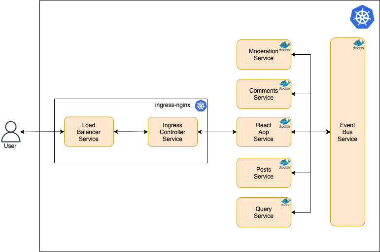

# Blogs Application

Blogs Application - This application is used as an introduction to containerization using Docker and orchestring thhese containers using Kuebernetes. In addition, we are using Skaffold to automate the build, push and deployment to the Kubernetes cluster.

The services will be intersacting with each other using the ClousterIP service. The outsidde world will be interactig with the posts service using the NodePort service.

## Getting Started

These instructions will get you a copy of the project up and running on your local machine for development and testing purposes. See deployment for notes on how to deploy the project on a live system.

In addition, you will have to modify your hosts file (/etc/hosts on Mac and C:\Windows\System32\Drivers\etc\hosts on Windows) as an administrator on your local system with the following added to the end  of the file:

```
127.0.0.1 blogposts.com
```

This is needed for local development in order to route blogposts.com to go to localhost (127.0.0.1) on your local system. 

### Running application using Skaffold

Please ensure you have skaffold installed on your local system. Then perform these steps:

Run the follwing command in your terminal:
```
skaffold dev
```

Go to the follwoing URL in your browser
```
blogposts.com
```

### Running application manually

These are the different commands that you could use to run this development enviornment. Please perform these steps in each folder to test the application:

```
npm install
```

To run in development:
```
blogposts.com
```

In your browser, go to: http://localhost:3000

## Deployment

To deploy to the Kubernetest cluster, run the following command in the root directory:
```
skaffold dev
```

In your browser, go to: blogposts.com

## Services

* ingress-controller-service - Route incoming traffic to pod on cluster.
* create-post Service - Create new blog posts.
* create-comment Service - Create new comments for a particular blog post.
* moderate-comment Service - Moderate all comments.
* query Service - Presist posts and comments. Used by other services to get latest and most updated lists of posts and comments.
* event-bus Service - Receive events from services  and emit these events to all services.
* ui-client Service - Create React App service (Front-End).


## Built With

* [Create React App](https://reactjs.org/docs/create-a-new-react-app.html) - Comfortable environment for learning React, and is the best way to start building a new single-page application in React.
* [Node.js](https://nodejs.org/en/) - JavaScript run-time environment.
* [Docker](https://www.docker.com/) - Set of platform as a service products that use OS-level virtualization to deliver software in packages called containers.
* [Kubernetes](https://kubernetes.io/) - Open-source system for automating deployment, scaling, and management of containerized applications.
* [Nginx](https://www.nginx.com/) - Web server that can also be used as a reverse proxy, load balancer, mail proxy and HTTP cache. 
* [Skaffold](https://skaffold.dev/) - Handles the workflow for building, pushing and deploying your application, allowing you to focus on what matters most: writing code.

## Architecture


## License

This project is licensed under the MIT License - see the [LICENSE.md](LICENSE.md) file for details
